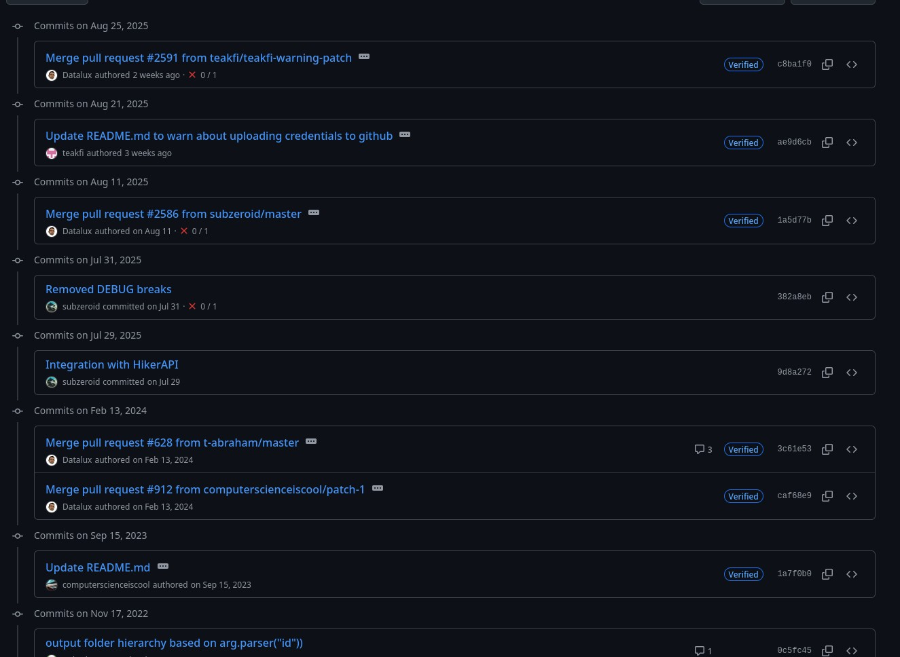

# OsintgramCXX
```text
   ___     _       _                            
  /___\___(_)_ __ | |_ __ _ _ __ __ _ _ __ ___  
 //  // __| | '_ \| __/ _` | '__/ _` | '_ ` _ \ 
/ \_//\__ \ | | | | || (_| | | | (_| | | | | | |
\___/ |___/_|_| |_|\__\__, |_|  \__,_|_| |_| |_|
                      |___/                     
```

Ever since the development on [the original Project](https://github.com/Datalux/Osintgram)
has stopped and the Instagram API being changed constantly, I have decided to take care
of this project and rewrite most to all components by myself. Well... except for the
Networking part, me and Networking aren't the best friends... just yet. Wait, until I
finish one of the most insane projects known to man. A hint, it's on my GitHub profile.

## Update from Datalux himself
Alright, so apparently, the original project is not completely abandoned. No, I was not
contacted by anyone to say that it is still alive in any way, don't even try to make me
drop my entire Inbox in here. Although I did attempt to reach out to him with no luck...
yes, again.

If you guys weren't up-to-speed, there has been some updates regarding that project. Two
PRs (Pull Requests) have been accepted and merged, along with that man himself creating a
new repo. Considering that he hasn't responded and refuses to talk and barely has the time
to talk to people or something (if that is his intention), I made a theory that he might
also be in an apprenticeship and potentially doing / preparing himself for the final exams,
clarifying on why there are barely any updates and no responses from this man alone.

In case you guys are lazy to check out that repo alone, here I provide a screenshot of the
recent commit logs happening:



---

## Use cases
No use cases just yet. Matter of fact, this project is still in active development, and I
am not planning to abandon this project, just like [Datalux](https://github.com/Datalux)
did. However, I will be doing Announcements and Polls, in case I would be disclosing more
information.

Alongside with that, since people were asking me about how to use this tool (you may see
an [example here](https://github.com/BC100Dev/osintgram4j/issues/16) from the previous
version). No offense to people waiting eagerly for the tool to come out, but since actual
development (without AI) does take some time, this won't be a "quick coding session". This
does take time, but I will be updating you guys on any updates.

However, what I can describe on what features are implemented (or will be) in here are these:
- **Modding Support**: Add your own Hooks and Commands to OsintgramCXX itself (requires C/C++
  coding skills)
- **DSI** (Device Spoofing Information): Spoofs a device for network calls to Instagram (what
  is an OSINT tool for the community without spoofing some shit)
- **Manual Interaction**: Using this tool means that you have more control than having most
  actions automated (e.g. automated login)
- **Proxies & Proxychains**: Allows you to connect to multiple Proxies at once, allowing a
  connection through several servers
- **Multi-Session Interaction**: Target multiple profiles at once without having to automate
  more things

Does the original version of this tool have most of those things prebuilt already? I don't
think so. Let me cook and you won't be disappointed.

---

## Disclaimer & Privacy Policy
OsintgramCXX, along with any other software, is merely intended for ethical and legal use
only. By the definition of OSINT, the use of this tool is to collect publicly available
information. This means that commands from the original version (like fetching E-Mail
addresses and phone numbers) are not copied over for legal reasons. By default, Instagram
does NOT expose sensitive information to the public, unless the person associated with the
account shares information. That information may include a publicly-known business E-Mail
address, business phone number or possibly even the physical business address tied to the
person / business.

Other developers, myself included, do not support unethical activities like black-hat
hacking (the unlawful version of hacking) and other malicious actions. Always follow
relevant laws and the Terms of Service of the perspective platform. Developers can still
be held accountable by designing such tools in the first place, so deploy this tool under
legal and good intentions. We do not want a lawsuit, neither any cease of desist letters.

By using this tool, you acknowledge that:
- **Responsibility**: You are accountable for the actions you take
- **Ethical Use**: You do not misuse this tool to your advantage in harassing people
- **Actions getting logged**: Instagram will log each action you take using this tool
- **Liability**: we, the developers, are not liable for the consequences you take by
  potentially misusing this tool.
- **Terms and Imprint**: using this tool, you also break the Instagram's [Terms of Service
  / Imprint](https://help.instagram.com/581066165581870/?locale=en_US)

---

## Build Process
To build the tool, you will need to install a few tools. Those tools include:
- CMake
- C++ compilers
- VCPKG dependencies (tar, unzip, zip, curl)

For this, using your package manager, install these following packages. This may vary on
your distribution. For Debian (Termux included), you will be using `apt`. Your full
command will be:

```shell
$ sudo apt install build-essential cmake tar unzip zip curl libssl-dev libcurl4-openssl-dev libcap-dev
```

The first few packages, up until the `curl` part, are required for `vcpkg` itself. Packages
with the prefix of `lib` are required, since they are required for the tool to function correctly.
If you are using Termux, exclude `libcap-dev`, since this library won't work on Android devices.

For Arch Linux users:
```shell
$ pacman -S base-devel cmake tar unzip zip curl openssl zlib
```

After installing these dependencies, run these two commands (simplified for VCPKG handling):
```shell
$ git clone https://github.com/BC100Dev/OsintgramCXX.git
$ cd OsintgramCXX
$ chmod +x prepare.sh
$ ./prepare.sh
```

This will download the sources of OsintgramCXX, along with preparing the environment for
building. After the execution of `./prepare.sh`, do the final blow with this command:

```shell
$ cmake --build Build
```

Once that has been built, the final files should be located directly at `Build/bundle`,
containing the `Osintgram` executable, along with its libraries. In the
`Build/bundle/Resources` directory are the core files for OsintgramCXX itself to run. The
`commands.json` is a requirement, since it houses all the commands for OsintgramCXX to be
able to index, which houses even the core commands themselves. `AppSettings.cfg` is an
optional file that isn't a requirement, since OsintgramCXX will take in the default values
that are already stored.

***!! For those already testing !!***
Please note that this is still a WIP, and that this is not the finalized version. I will
make an announcement, once OsintgramCXX receives the first stable release build.

### Building on non-Linux systems
Okay, but you might be running Windows or macOS, so how else can you build it? Different
methods include:

- Virtual Machines
- Cloud Shell (via SSH)
- Containers (e.g. Docker)
- Dual-Booting (if you have a Windows PC)
- WSL (Windows only)
- Termux (Android only, still experimenting for a proper build)

---

## Default modules
For the default installment of this tool, I decided to separate the codebase into multiple
sections, which include:

- [**Core Application**](Sources/Application): The code that starts up, once you launch that
  nice `./OsintgramCXX` executable. No, this one is not a library, the others are.
- [**Shared Code**](Sources/Commons): A shared codebase that is shared upon the other modules,
  utilizing the DRY methods
- [**Interactive Commands**](Sources/CoreCommands): The part that would give you the most
  interests, considering that it is the base module, where all the standard commands live at.
- [**Instagram Private API**](Sources/instagram-private-api): Oh, this one's spicy, eh? Yes,
  this code will be the main reason all your custom mods will most likely depend on. That is,
  if you don't rely on user input and probably automate.
- [**Application Logging**](Sources/Logging): Nice library to have, in case GDB is a bit too
  hard to understand and not having to rely on the console output itself. Threaded or not,
  logging is a must. If you can't log, and you can't reproduce the error, then how are you
  going to fix them? :neutral_face:
- [**Networking**](Sources/Networking): The Instagram APIs use them. The application alone
  uses it to do other possible communications. It's needed. And it's simple to use. See
  [the header](Include/OsintgramCXX/Networking/Networking.hpp) itself, and you'll learn, how
  simple it is to make a Network request... that is, if you consider yourself as a proper
  programmer and not a wannabe dev :skull:
- [**Security layers**](Sources/Security): A reason to make your accounts secure, whether
  local or somewhere online, is to securely encrypt them. OsintgramCXX doesn't take a raw
  configuration file right at the start. You explicitly use the `loginctl` command itself
  to log in.

While most of the code are statically linked (hello, vcpkg), all of those libraries are
shared libraries that can be linked via `gcc` or `clang`. Use them to your fullest extent,
you may need them.

---

## Modding Support
Yes, I may have promised that feature back in
[Osintgram4j](https://github.com/BC100Dev/osintgram4j) itself, but I have decided to take
things up a notch and actually create a proper one. With this modding support, you can write
your own C/C++ shared library, have them linked with the
[`commands.json`](Resources/commands.json) itself, and include your own commands, handlers
and much more. As the development stage is still in the middle stages and other ideas coming
in, the format for it will change, especially with the first version, considering that the
current version provides simple commands (`cmd`, `description`, `exec_symbol`). However,
please note that it is currently not possible to validate the parameters for the symbol of
the library entry (the method that gets invoked), so please keep in mind that you have to
include a method that matches exactly by the parameters. If that isn't matched, OsintgramCXX
will crash. Following this sample, you can create a symbol for a command:

```c++
// if using C, skip the <export "C"> part
export "C" int cmd_symbol(const char* cmd, int argc, char** argv, int envc, char** env_map) {}
```

The symbol passes in the `cmd` value, aka. the command that you assigned the library and the
symbol for. The `argc` and `argv` are self-explanatory, since they resemble that known C/C++
`int main(int argc, char** argv)` thing, except that the first parameter is not the command
itself. Instead of having the shell environment map within one `envp` parameter, I decided
to separate the count and the map into two parameters.

Along with that, you are able to create handlers for each call. For example, you can have
a handler that runs immediately, once OsintgramCXX completes loading the necessary things.
The same goes, when OsintgramCXX is stopping. Please keep in mind that no program can catch
the SIGKILL signal. The line required for these handlers would be for your codebase:

```c++
export "C" void plugin_start() {}

export "C" void plugin_stop() {}
```

Want to snoop, what a command gets executed in the first place? Worry not, include a CMD
starting and finishing handle by making these methods:

```c++
export "C" void cmd_handle_start(const char* cmdLine) {}

export "C" void cmd_handle_finish(const char* cmdLine, int rc, int id, const char* stream) {}
```

With the `cmd_handle_finish`, you pass in the entire command line that the user has entered,
gives in the `rc` (Return Code) value, `id` being the Plugin / Mod Identifier, and `stream`
being the entire `stdout` & `stderr` stream.

The possibilities are endless. You can start creating one now.

Also keep in mind that I will not support any modifications / plugins that violates the
Instagram ToS harder than this tool already does.

---

Oh, and before I forget... womp womp, macOS users :skull: